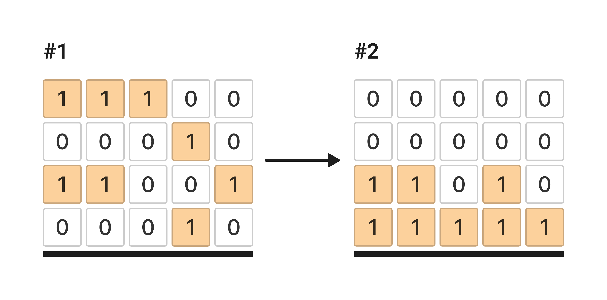

У вас есть переменная grid которая содержит входные пользовательские данные.

grid - двухмерный массив из элементов типа данных int. 

Переменная grid содержит двумерный массив подвешенных блоков (#1), представленных в виде (1), в то время как (0) - это пустоты.

Напишите код, который создает новый массив (#2), в котором к блокам применена условная гравитация и они прижаты к земле. Новый массив запишите в переменную result.

Важно! Размер двумерного массива grid может быть любым.

Sample Input:

[[1,1,1,0,0],[0,0,0,1,0],[1,1,0,0,1],[0,0,0,1,0]]
Sample Output:

[[0,0,0,0,0],[0,0,0,0,0],[1,1,0,1,0],[1,1,1,1,1]]