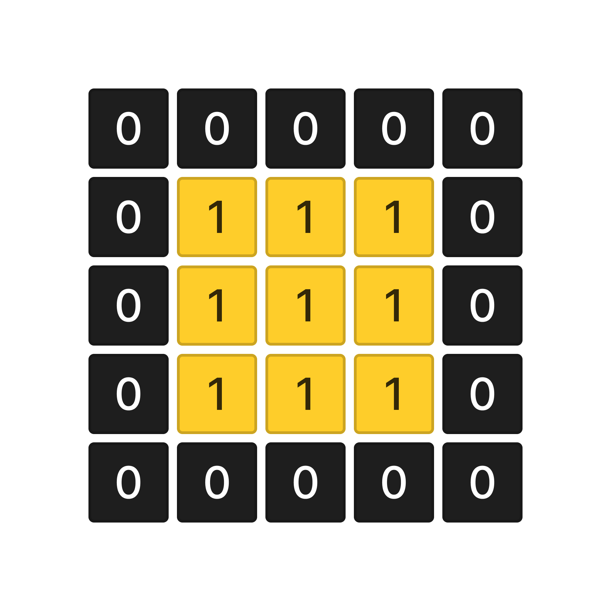

У вас есть переменная grid которая содержит входные пользовательские данные.

grid - двумерный массив чисел (игровое поле), который состоит из 0 - клетки поля и 1 - одного источника света, массив произвольного размера но с минимальным количеством элементов 3x3.

Количество элементов может быть как четное так и нечетное.

Напишите код, который создает новый массив заполненный светом (клетками со значением  1 ) так чтобы паттерн его распространения был таким как на примере ниже. Независимо от того где изначально был расположен источник света 1 - паттерн распространения света должен сохранятся как на примере ниже.

Новый массив необходимо записать в переменную result.
Важно! 
Паттерн распространения света:
Несколько примеров игрового поля 3x3 с источником света и его распространением:

Двухмерный массив произвольного размера.
Минимальный размер масива 3x3.
Если размер входящего массива меньше чем 3x3 тогда оставляем его без изменений и распространение света не производим.
Массив состоит из 0 и одного элемента со значением 1.
Лучи света должны распространяться только на одну игровую клетку.
Sample Input 1:

[[0,0,0],[0,1,0],[0,0,0]]
Sample Output 1:

[[1,1,1],[1,1,1],[1,1,1]]
Sample Input 2:

[[0,0,0],[1,0,0],[0,0,0]]
Sample Output 2:

[[1,1,0],[1,1,0],[1,1,0]]