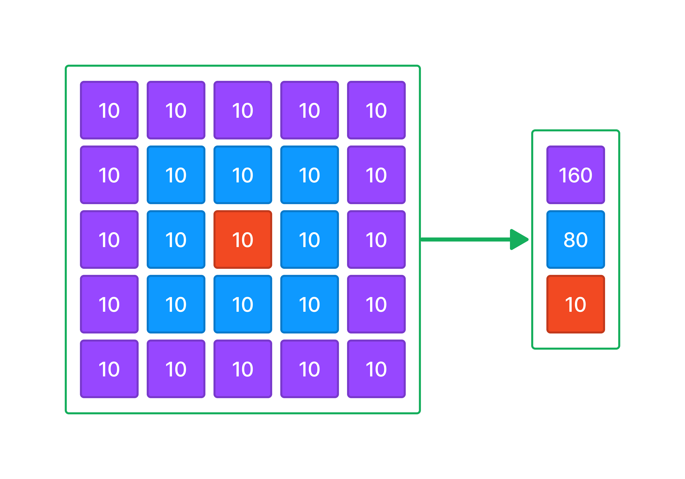

У вас есть переменная grid которая содержит входные пользовательские данные.

grid - двумерный список чисел произвольного размера но с равным количеством элементов, 5x5, 6x6, 7x7 и тд.

Напишите код, который подсчитывает сумму элементов в каждом круге двухмерного списка data и записывает результат в виде нового списка в порядке от большего круга к меньшему кругу в переменную result.

Sample Input:

[[10, 10, 10, 10, 10],[10, 10, 10, 10, 10],[10, 10, 10, 10, 10],[10, 10, 10, 10, 10],[10, 10, 10, 10, 10]]
Sample Output:

[160,80,10]