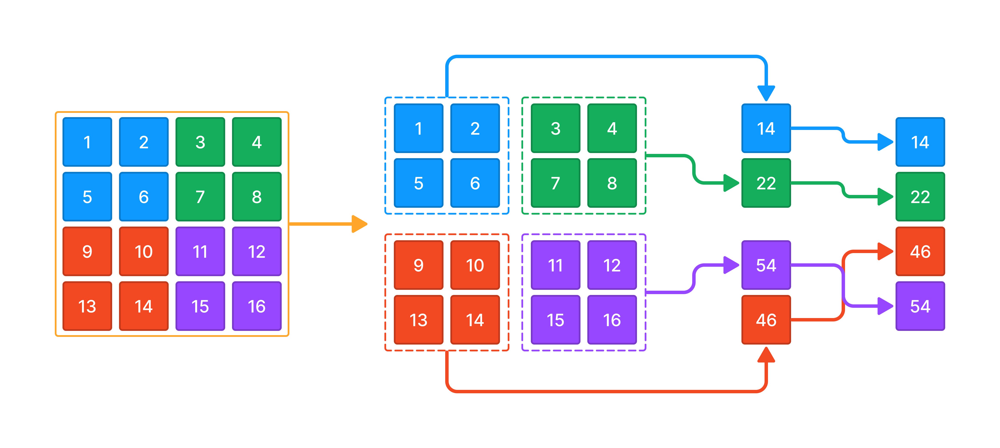

У вас есть переменная grid которая содержит входные пользовательские данные.

grid - двумерный список чисел произвольного размера но с равным количеством элементов, 4x4, 6x6, 8x8, 10x10 и тд - всегда четное количество.

Напишите код, который вычисляет суму элементов каждого квадрата списка data и записывает результат в виде нового отсортированного по возрастанию списка в переменную result.

Sample Input 1:

[[1,2,3,4],[5,6,7,8],[9,10,11,12],[13,14,15,16]]
Sample Output 1:

[14,22,46,54]
Sample Input 2:

[[10,20,30,40],[50,60,70,80],[90,10,11,12],[13,14,15,16]]
Sample Output 2:

[54,127,140,220]